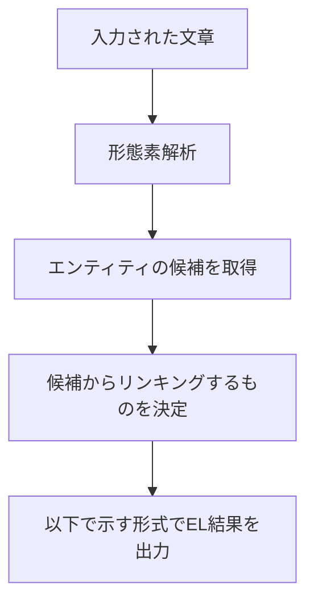

# entity-lnking-by-wikidata
 wikidataを対象としたEntityLinkingシステム:
 [デモサイト](https://shunafuku.github.io/entity-lnking-by-wikidata/)
 
# ELの流れ

 
# EL結果のデータ形式
 ```
 {
   "text": ,              //(String)EL対象の文字列
   "entityLinking": [     //(Array)EL結果一覧を格納する配列
     {
       "label": ,         //(String)EL対象の文字列
       "link": ,          //(String)リンクしたEntityのURI
       "startPosition": , //(Number)EL対象の文字列の、textでの始まる位置
       "endPosition":     //(Number)EL対象の文字列の、textでの終わる位置
     },
     ...
   ]
 }
 ```

# 参考にしたサイト
## 形態素解析
### kuromoji.js
- https://github.com/takuyaa/kuromoji.js/
- https://zenn.dev/sdkfz181tiger/articles/daef6f0f8156d8
